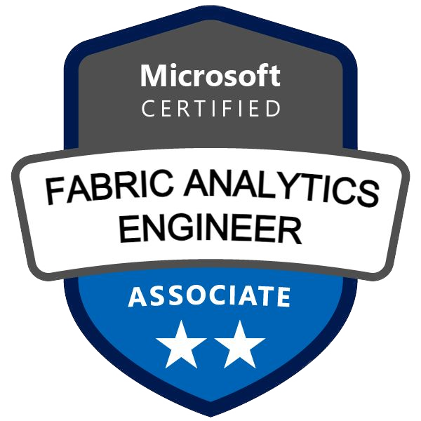
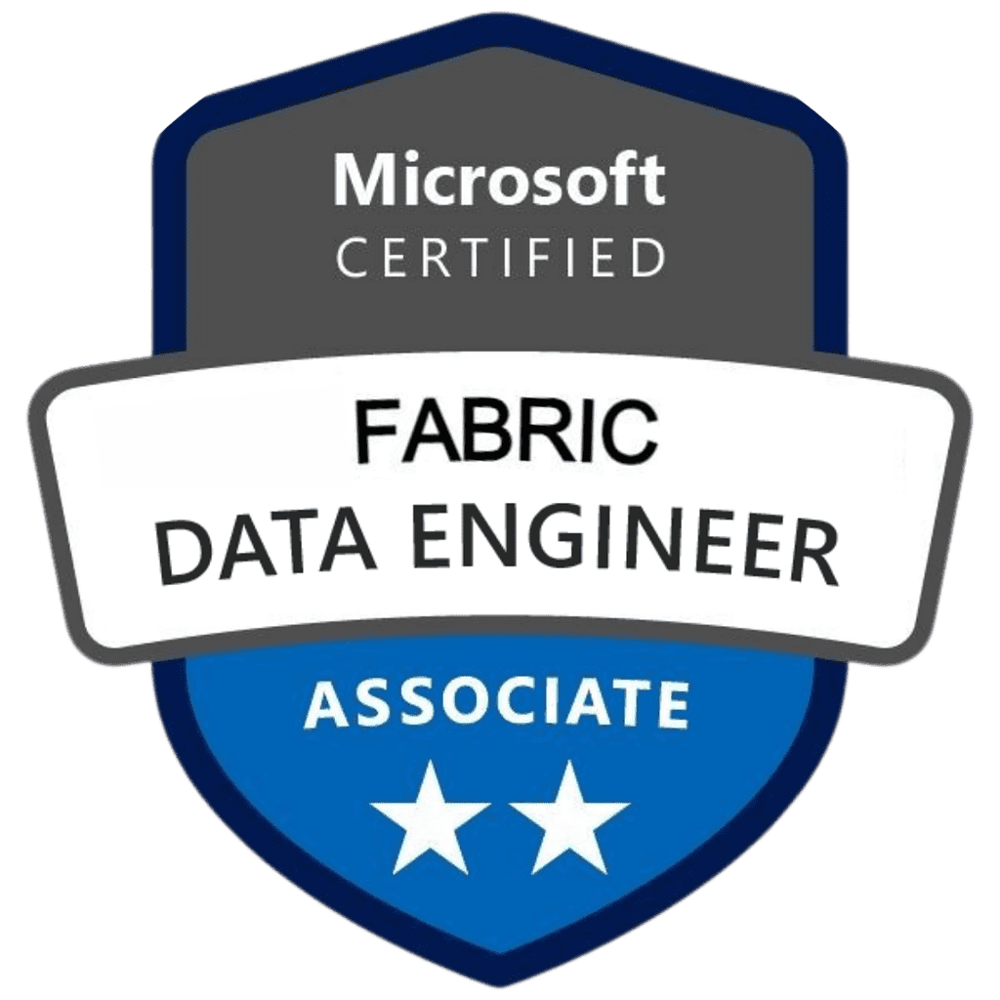
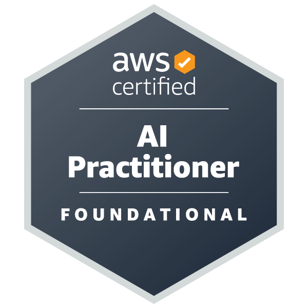

# Senior Data Analyst | Microsoft Fabric Solutions Architect (DP-600 & DP-700)

> The best time to plant a tree was 20 years ago the second best time is now. - Chinese proverb

## 🧾 Profile Summary

I am a **Senior Data Analyst** with a background in **Chemical & Reliability Engineering**, specializing in building high-integrity, multi-cloud data solutions. As a **triple-certified professional in AWS AI and Microsoft Fabric (DP-600 & DP-700)**, I bridge the gap between industrial reliability and modern cloud architecture—transforming raw ingestion into high-performance, AI-augmented semantic models.

**⚡ Expertise:** Microsoft Fabric (Lakehouse, Warehouse, DirectLake, Semantic Modeling), Python, SQL, DAX, PySpark, Power BI, GenAI Implementation.  
**📍 Interests:** End-to-End Data Architecture, Predictive Maintenance, Algorithm Optimization, Marathons! 🏃‍♂️

  
  
  

## 💼 Working Experience

### **Senior Data Analyst** @ *PerkinElmer*
📅 *November 2025 – Present*
- **Global Sourcing Optimization (GSO):** Leading the data architecture for the GSO project, driving **$24.01M in identified savings** through automated tracking and procurement optimization.
- **AI-Driven Workflow Automation:** Engineered an automated system for weekly data compilation and AI-augmented analysis of **Past Due POs**. The system generates actionable "next steps" for buyers, **reducing managerial manual drafting time by 95%**.
- **End-to-End Fabric Implementation:** Architecting comprehensive pipelines in Microsoft Fabric, spanning from Data Factory ingestion to optimized Power BI semantic models for global supply chain and R&D.
- **Medallion Architecture Mastery:** Implementing Lakehouse and Warehouse structures to centralize global data, utilizing T-SQL and PySpark to ensure data is "analytics-ready" for business stakeholders.
- **Automation & GenAI:** Automating ETL workflows using Python and Gemini CLI; integrating Asana API and SAP BusinessObjects data to eliminate manual reporting.

### **Data Science Engineer** @ *Coherent Corp*  
📅 *September 2024 – November 2025*
- Developed enterprise-wide Power BI dashboards to monitor OEE, reducing manual reporting time by 60%.
- Designed scalable ETL pipelines using **Python**, **SQL**, and **PySpark**, cutting data processing time by 50%.
- Optimized SQL Server queries, slashing execution time by 97%.
- Mentored interns on building **Streamlit** apps for automated performance monitoring.

---

### **Reliability Engineer** @ *Jacobs Douwe Egberts*  
📅 *October 2022 – September 2024*
- Created real-time KPI dashboards with **Power BI** for machine reliability tracking.
- Analyzed 25,000+ rows of raw data in one day to generate actionable insights for suppliers.
- Led 5+ global coaching sessions on Microsoft 365 AI tools.
- Designed master data structures for predictive maintenance strategies.
- Reduced dehumidifier leakage by 80% with custom monitoring systems.

---

## 🎓 Education

- **MSc in Data Science** (ODL) | *Universiti Teknologi PETRONAS*  
  📅 *May 2024 – Sep 2025*  
  **CGPA:** 3.91 / 4.00  
  *Thesis: Development of Machine Learning Models for Failure Prediction in Oil & Gas Rotating Equipment*
  - One of the Postgraduate Awards receipients in MSc Data Science

- **BEng in Chemical Engineering (Hons)** | *Universiti Sains Malaysia*  
  📅 *Sep 2018 – Aug 2022*  
  **CGPA:** 3.90 / 4.00  
  - Book Prize Recipient – School of Chemical Engineering  
  - Top 10 Final Year Project & Best Plant Design Team

## 📍 Featured Projects

### 🧠 [**Development of Machine Learning Models for Failure Prediction in Oil & Gas Rotating Equipment**](https://github.com/Ether-silicon/predictive_maintenance)
Developed multi-sensor ML models to predict failures in refinery rotating equipment. Achieved 99.9% accuracy with Random Forest, demonstrating robust feature engineering.

### 🏃‍♂️ [**Garmin Analytic & Performance Dashboard**](https://garminanalyticdashboard.streamlit.app/)
Interactive web dashboard analyzing health & performance metrics (pace, HR, GPS) from Garmin/Strava exports using **Streamlit**.

---

## 🧠 Skills & Tools

- **Fabric Ecosystem:** OneLake, Lakehouse/Warehouse, Data Factory, Dataflows Gen2, **Advanced Semantic Modeling (DirectLake)**, Deployment Pipelines, Spark Notebooks.  
- **Languages:** Python (Expert), SQL (T-SQL/Spark SQL), DAX (Advanced), R, PySpark, VBA.  
- **AI/ML:** GenAI Adoption, LLM Prompt Engineering, NotebookLM, Scikit-Learn.  
- **Certifications:**
  - **AWS Certified: AI Practitioner** 🎓 (Score: 833)
  - **Microsoft Certified: Fabric Analytics Engineer Associate (DP-600)** 🎓 (Score: 884)
  - **Microsoft Certified: Fabric Data Engineer Associate (DP-700)** 🎓
  - CS50 Python, R & SQL – Harvard University
  - Snowflake ETL Mastery

---

## 🏅 Awards & Recognition

- 🏆 **Postgraduate Award** – MSc Data Science (UTP)
- 🎖️ **5th Place** – SEA-GIC 2020 (58 teams, Southeast Asia)
- 📚 **Book Prize** – School of Chemical Engineering (USM)
- 🏆 Best Final Year Plant Design Team (USM)

---

## 🎤 Presentations

- [IChemE Workshop – *Exploring Data Analytic Through Excel*](https://www.linkedin.com/feed/update/urn:li:activity:7182005285408968705/)  
  📍 University of Nottingham Malaysia, March 2024
